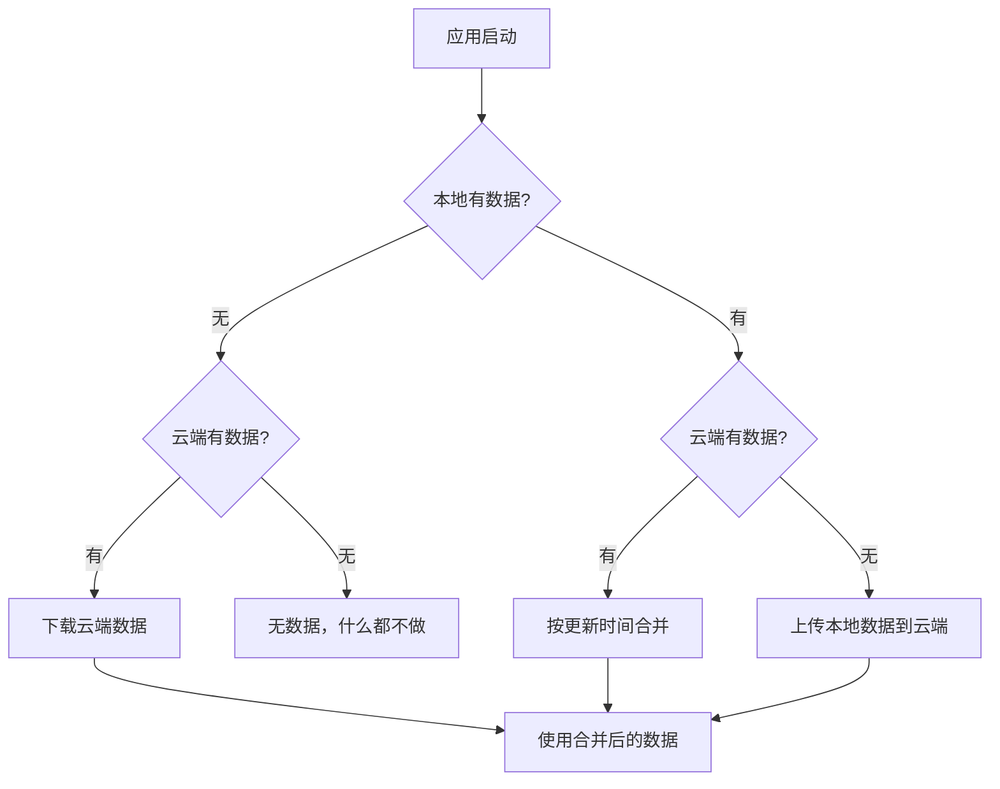

# Supabase 云同步功能说明

## 1. 连接是怎么建立的？

### 1.1 配置文件

项目根目录的 `.env.local` 文件中配置了两个关键变量：

```bash
NEXT_PUBLIC_SUPABASE_URL=https://yghuvwplnignwjwqqjwm.supabase.co
NEXT_PUBLIC_SUPABASE_ANON_KEY=你的anon_key
```

> 注意：必须使用 `NEXT_PUBLIC_` 前缀的 **anon key**，而不是 service_role key，否则会有安全风险。

### 1.2 客户端连接

在 `src/lib/supabase/client.ts` 中创建了浏览器端专用的 Supabase 客户端：

```typescript
import { createBrowserClient } from '@supabase/ssr'

export function createClient() {
  return createBrowserClient(
    process.env.NEXT_PUBLIC_SUPABASE_URL!,
    process.env.NEXT_PUBLIC_SUPABASE_ANON_KEY!
  )
}
```

### 1.3 服务端连接

在 `src/lib/supabase/server.ts` 中创建了服务端专用的 Supabase 客户端（用于 API 路由）：

```typescript
import { createServerClient } from '@supabase/ssr'
import { cookies } from 'next/headers'

export async function createClient() {
  const cookieStore = await cookies()
  return createServerClient(
    process.env.NEXT_PUBLIC_SUPABASE_URL!,
    process.env.NEXT_PUBLIC_SUPABASE_ANON_KEY!,
    {
      cookies: {
        getAll() { return cookieStore.getAll() },
        setAll(cookiesToSet) {
          try { cookiesToSet.forEach(({ name, value, options }) => cookieStore.set(name, value, options)) }
          catch {}
        },
      },
    }
  )
}
```

---

## 2. 数据是怎么传到 Supabase 的？

### 2.1 核心文件：同步服务

`src/lib/supabase/sync.ts` 是整个同步逻辑的核心，它是一个类 `SupabaseSyncService`：

**主要功能：**

| 功能 | 说明 |
|------|------|
| `uploadNovels()` | 将本地小说数组整体上传到 Supabase（用 upsert，有则更新、无则插入） |
| `fetchNovels()` | 从 Supabase 拉取当前用户的所有小说 |
| `debouncedSync()` | 防抖上传，数据变化后等待 2 秒再上传，避免频繁请求 |
| `init()` | 初始化时合并本地和云端数据 |
| `mergeNovels()` | 按更新时间合并冲突，保留最新修改 |

### 2.2 数据模型映射

| Zustand Store 中的 Novel 对象 | Supabase novels 表字段 |
|-------------------------------|------------------------|
| `id` | `novel_id` |
| `title` | `title` |
| `author` | `author` |
| `description` | `description` |
| `status` | `status` |
| `coverId` | `cover_id` |
| `createTime` | `create_time` |
| `updateTime` | `update_time` |
| `chapters`（数组） | `chapters`（JSONB 格式） |
| `selectedTags`（数组） | `selected_tags`（PostgreSQL 数组格式） |

### 2.3 触发同步的地方

同步被集成在 `src/store/useNovelListStore.ts` 中。每次调用以下操作时，会自动触发 `triggerSync()`，将当前整个小说列表上传到 Supabase：

- 新建小说
- 更新小说信息
- 新建/编辑/删除章节
- 更新章节内容
- 删除小说
- 切换标签

---

## 3. 初始化流程是怎样的？

### 3.1 应用启动时

当用户首次打开编辑器页面（`/editor`）时，`SyncStatusIndicator` 组件会调用 `initSync()`：

```
initSync() → supabaseSync.init()
```

### 3.2 初始化逻辑



---

## 4. 冲突解决策略

当本地和云端都有数据时，按以下规则合并：

1. **只在一边存在的小说**：直接保留
2. **两边都存在但内容不同**：以**更新时间更晚**的为准

---

## 5. 怎么看同步状态？

### 5.1 应用内

编辑器页面顶栏有一个同步状态指示器，显示：
- 「已保存到云端」或「已同步」- 同步成功
- 「同步中...」- 正在上传
- 「同步失败」- 出现错误，可点击重试

### 5.2 在 Supabase 后台查看

1. 进入 **Supabase Dashboard**
2. 左侧菜单选择 **Table Editor**
3. 选择 `novels` 表
4. 可以看到所有已同步的小说数据

或者在 **SQL Editor** 中执行：
```sql
SELECT * FROM novels;
```

---

## 6. 数据库表结构

表名：`novels`

| 字段名 | 类型 | 说明 |
|--------|------|------|
| `id` | BIGINT | 自增主键 |
| `user_id` | TEXT | 用户唯一标识（自动生成） |
| `novel_id` | TEXT | 小说唯一 ID |
| `title` | TEXT | 小说标题 |
| `author` | TEXT | 作者 |
| `description` | TEXT | 简介 |
| `status` | TEXT | 状态（连载中/已完结） |
| `cover_id` | TEXT | 封面图片 ID |
| `create_time` | TIMESTAMPTZ | 创建时间 |
| `update_time` | TIMESTAMPTZ | 更新时间 |
| `chapters` | JSONB | 章节数组（完整内容） |
| `selected_tags` | TEXT[] | 标签数组 |

**索引**：
- `idx_novels_user_id` - 按用户 ID 快速查询
- `idx_novels_update_time` - 按更新时间排序

**RLS（行级安全）**：已启用，但当前配置为允许所有操作（`USING (true) WITH CHECK (true)`），适合个人项目。

---

## 7. 文件清单

| 文件路径 | 作用 |
|----------|------|
| `.env.local` | 环境变量（URL 和 Key） |
| `src/lib/supabase/client.ts` | 浏览器端 Supabase 客户端 |
| `src/lib/supabase/server.ts` | 服务端 Supabase 客户端 |
| `src/lib/supabase/sync.ts` | 核心同步逻辑 |
| `src/lib/supabase/types.ts` | TypeScript 类型定义 |
| `src/lib/supabase/index.ts` | 统一导出 |
| `src/store/useNovelListStore.ts` | Zustand 状态管理 + 同步触发 |
| `src/components/SyncStatusIndicator.tsx` | 同步状态显示组件 |
| `supabase/schema.sql` | 数据库建表脚本 |

---

## 8. 常见问题

### Q: 为什么同步没生效？
- 检查是否进过编辑器页面（`/editor`），初始化只在编辑器触发
- 查看浏览器控制台（F12）是否有 Supabase 请求报错
- 确认 Supabase 表已创建且 RLS 策略正确

### Q: 本地数据会覆盖云端吗？
- 不会。初始化时会合并，以最新修改为准

### Q: 能否不用 Supabase？
- 可以。同步逻辑独立于业务逻辑，数据仍然保存在 localStorage。删除 Supabase 相关代码后应用正常运行。
